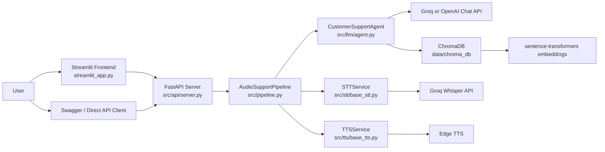
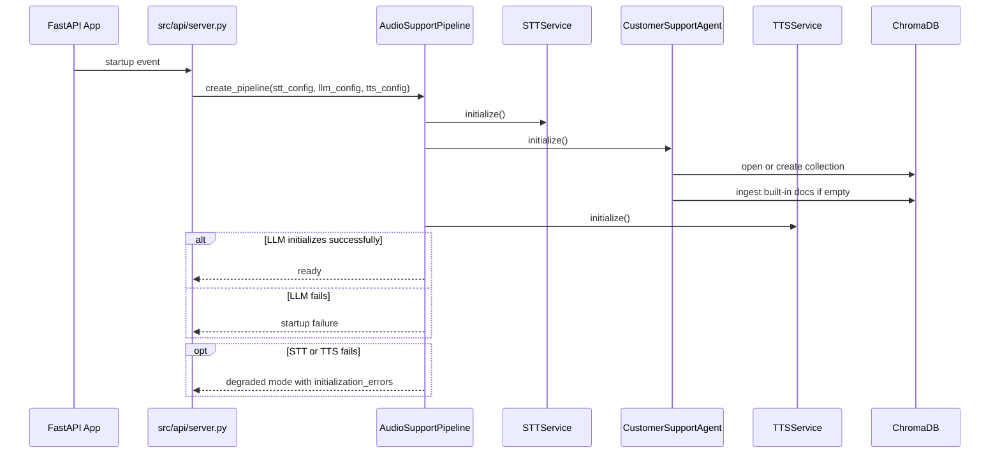
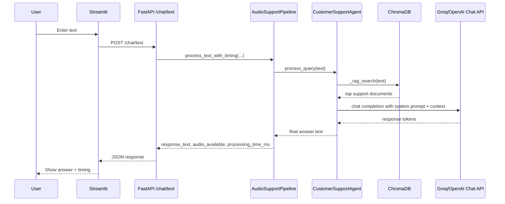
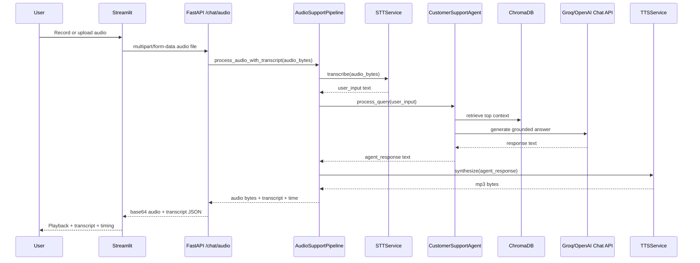
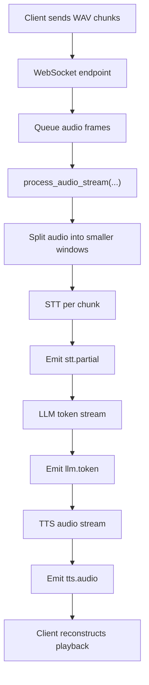
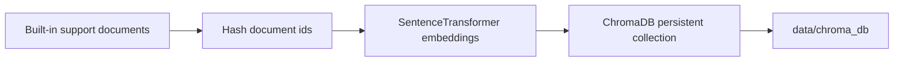

# System Architecture

This document explains the full request flow of the Audio Customer Support Agent, from startup through text, audio, and streaming requests.

## High-Level Overview

The system has two runtime layers:

1. A Streamlit UI for manual testing
2. A FastAPI backend that orchestrates STT, LLM, retrieval, and TTS

## Core Components

### 1. Streamlit frontend

File:

- `streamlit_app.py`

Responsibilities:

- provides a text chat tab
- provides an audio upload and recording tab
- checks backend health
- displays transcript, processing time, and audio playback
- acts as a manual integration test surface for the API

### 2. FastAPI server

File:

- `src/api/server.py`

Responsibilities:

- loads environment variables
- builds configuration for STT, LLM, and TTS
- creates the shared pipeline on startup
- exposes REST and WebSocket endpoints
- normalizes health and error responses

### 3. Pipeline orchestrator

File:

- `src/pipeline.py`

Responsibilities:

- coordinates the STT -> LLM -> TTS flow
- supports text-only requests
- supports audio requests with transcript metadata
- supports streaming chunk-based processing
- tracks degraded startup state through `initialization_errors`

### 4. STT service

File:

- `src/stt/base_stt.py`

Responsibilities:

- accepts audio bytes
- sends them to Groq transcription API
- returns normalized text
- supports chunk-based transcription for streaming mode

### 5. LLM agent

File:

- `src/llm/agent.py`

Responsibilities:

- manages the HTTP client for Groq or OpenAI
- maintains the customer support knowledge base
- performs RAG lookup before generation
- streams model output tokens

### 6. TTS service

File:

- `src/tts/base_tts.py`

Responsibilities:

- converts final response text to audio
- streams Edge TTS audio chunks when needed

## Startup Flow

At application startup, FastAPI creates one shared `AudioSupportPipeline` instance.

### Degraded mode behavior

The backend now starts in degraded mode if optional components fail.

- LLM is required for the app to be useful
- STT is optional for text chat
- TTS is optional for text chat

That means:

- `/chat/text` can still work when STT is down
- `/chat/text` can still work when TTS is down
- `/chat/audio` still requires STT and TTS to be available

## Text Request Flow

Route:

- `POST /chat/text`

Purpose:

- lets you test the LLM and RAG layer without needing audio

### Important details

- Text requests no longer call the LLM twice.
- Text requests do not require TTS unless audio generation is explicitly requested.
- The route accepts aliases like `generate_audio`, `include_audio`, and `synthesize_audio`.

## Audio Request Flow

Route:

- `POST /chat/audio`

Purpose:

- runs the full speech-to-speech pipeline

### Audio response contract

Successful responses contain:

- `success`
- `audio_response`
- `transcript.user_input`
- `transcript.agent_response`
- `processing_time_ms`

Error responses are standardized and contain:

- `success = false`
- `error`
- `transcript.user_input = null`
- `transcript.agent_response = null`
- `processing_time_ms`

## Streaming Flow

The app also exposes low-latency audio streaming interfaces.

### HTTP streaming

Route:

- `POST /chat/audio/stream`

Behavior:

- accepts a single uploaded audio file
- runs the streaming pipeline internally
- returns audio bytes as a chunked streaming response

### WebSocket streaming

Route:

- `WS /chat/audio/stream`

Behavior:

- client sends binary audio frames
- client sends `END` when the turn is complete
- server returns incremental JSON events

Event types:

- `stt.partial`
- `llm.token`
- `tts.audio`
- `stream.complete`
- `error`
- `warning`

## Retrieval-Augmented Generation Flow

The RAG layer is embedded directly in `CustomerSupportAgent`.

### Knowledge source

The support knowledge base is seeded from in-code documents in:

- `CustomerSupportAgent._get_customer_support_documents()`

Topics include:

- returns
- shipping
- support
- warranty
- technical support
- account
- orders
- payment
- billing
- products

### Ingestion flow

### Query flow

For each user question:

1. The agent calls `_rag_search(query)`
2. Chroma returns the top matching documents
3. The documents are formatted into a knowledge context block
4. That context is injected into the system prompt
5. The model generates the final answer using both instruction and context

## Health Model

The health endpoint reports four readiness flags:

- `pipeline_initialized`
- `stt_ready`
- `llm_ready`
- `tts_ready`

The message is human-readable and explains whether the system is:

- fully healthy
- degraded but still usable for text
- unavailable because the LLM failed to initialize

## Error Handling Strategy

The architecture separates optional failures from hard failures.

Hard failures:

- LLM cannot initialize
- pipeline cannot be created

Soft failures:

- STT unavailable during startup
- TTS unavailable during startup
- knowledge base unavailable during startup

Soft failures do not necessarily block text chat.

## Persistent State

### Persistent

- Chroma database files in `data/chroma_db`

### In-memory only

- live FastAPI pipeline instance
- current HTTP clients
- Streamlit session state
- streaming queues

## Frontend to Backend Mapping

The Streamlit app maps directly to backend endpoints.

| Streamlit area | Backend route | Notes |
|---|---|---|
| Text Chat | `POST /chat/text` | best route to validate LLM connectivity |
| Audio Chat | `POST /chat/audio` | full speech pipeline |
| Health Monitor | `GET /health` | shows degraded mode clearly |
| Sidebar status check | `GET /` and `GET /health` | basic connectivity + readiness |

## Most Important Design Decisions

### 1. LLM-first survivability

The system is designed so the LLM path is the most important path.

- if LLM works, the app can still provide value
- if STT or TTS breaks, text chat remains available

### 2. Single pipeline instance

The backend creates one shared pipeline on startup instead of building services per request.

Benefits:

- lower overhead
- shared health model
- shared knowledge base lifecycle

### 3. Contract-first API responses

Audio responses use a structured JSON contract for both success and failure.

Benefits:

- easier frontend rendering
- easier testing
- clearer troubleshooting

### 4. Embedded RAG rather than external retrieval service

The knowledge base lives inside the LLM agent process.

Benefits:

- simpler local deployment
- no extra retrieval service to run
- persistence survives server restarts

## Key Files To Read First

If you want to understand the codebase quickly, read in this order:

1. `src/api/server.py`
2. `src/pipeline.py`
3. `src/llm/agent.py`
4. `src/stt/base_stt.py`
5. `src/tts/base_tts.py`
6. `streamlit_app.py`

## Summary

At runtime, the system works like this:

1. Streamlit or another client calls FastAPI
2. FastAPI forwards the request to `AudioSupportPipeline`
3. The pipeline routes the request through the necessary components
4. The LLM agent performs retrieval and generation
5. Audio requests are synthesized back to speech
6. The API returns text, audio, transcript, timing, and health metadata in a consistent format

The result is a practical testable architecture for a customer support voice assistant that supports both synchronous and streaming interaction modes.
